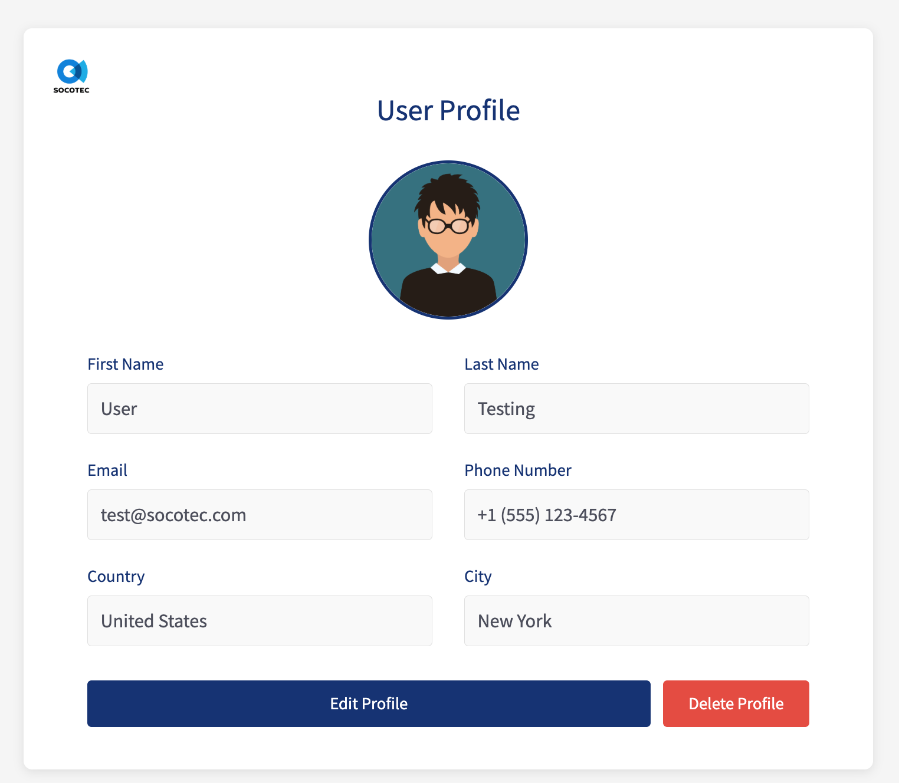

# User Profile Management System

## What I Built
A full-stack user profile management app using React and Node.js. Users can create, view, edit, and delete profiles with profile pictures.



## Quick Start

### What You Need
- [Docker Compose](https://docs.docker.com/compose/install/)
- Node.js (v14+)
- npm

### Getting Started
1. Clone and create a new branch
2. Copy environment files:
   - `backend/.env.example` → `backend/.env`
   - `frontend/.env.example` → `frontend/.env`
3. Install and run:
   ```bash
   # Backend with Docker (first time)
   cd backend && npm install

   # If database already exists, clean it first
   docker-compose down -v

   # Start containers (database will initialize automatically)
   npm run docker:up

   # Wait for database to be ready, then run migrations
   npm run migrate

   # Frontend with Docker (new terminal)
   cd frontend && docker-compose up

   # OR run frontend without Docker
   cd frontend && npm install && npm start
   ```

### Database Setup Notes
- First run: `schema.sql` and `insert.sql` initialize automatically
- Subsequent runs: Use `npm run migrate` for schema changes
- To reset database completely: `cd backend && docker-compose down -v`

## My Design Decisions

### 1. Service Layer Pattern
**What I did**: Created separate service classes (`UserService`, `FileService`) instead of putting all logic in routes.

**Why**:
- Routes were getting messy with too much logic
- Wanted to reuse the same logic in different places
- Makes testing much easier - can test business logic separately
- When I need to change how users are created, I only touch one file

### 2. Custom Error Handling
**What I did**: Built custom error classes and a central error handler that logs everything to a file.

**Why**:
- Got tired of inconsistent error responses across different endpoints
- Wanted all errors logged in one place for debugging
- Users should see helpful messages, not stack traces
- Each error type automatically gets the right HTTP status (404, 409, etc.)

### 3. Centralized Configuration
**What I did**: Put all config in one file (`backend/config/index.js`).

**Why**:
- Hated searching for where a port or file size limit was defined
- All settings in one place makes changes easier
- Environment variables with good defaults
- Clear structure that's easy to understand

### 4. Security Additions
**What I did**: Added Helmet for headers, rate limiting, and strict validation.

**Why**:
- Helmet protects against common attacks (XSS, clickjacking) with minimal effort
- Rate limiting (100 requests per 15 min) prevents abuse
- File uploads are risky - strict type and size checks
- Input validation on both frontend and backend

### 5. Testing Strategy
**What I did**: Wrote 18+ tests covering services, routes, hooks, and components.

**Why**:
- Wanted confidence that refactoring wouldn't break things
- Service tests use mocked database, so they're fast
- Route tests use supertest to test actual HTTP requests
- Frontend tests ensure hooks and components work correctly
- Tests document how the code should behave

### 6. Component Organization
**What I did**: Split into `ProfileForm`, `ProfileDetail`, and reusable components (`Toast`, `ConfirmModal`).

**Why**:
- Each component has one job
- Toast and ConfirmModal are used everywhere - no duplication
- Easier to find bugs when components are small
- Form logic is complex - keeping it separate from display logic helps

### 7. Database Migrations
**What I did**: Used `node-pg-migrate` for schema changes.

**Why**:
- Database changes need to be tracked like code changes
- Can roll back if something goes wrong
- Everyone on the team gets the same database structure
- Lightweight tool - just handles migrations, no heavy ORM

### 8. Styling Choices
**What I did**: Plain CSS files, one per component.

**Why**:
- No extra dependencies or build steps
- Clear which styles belong to which component
- Easy to maintain with good naming
- SOCOTEC brand colors and logo integrated throughout

## Project Structure

### Backend
```
backend/
├── config/           # All configuration in one place
├── middlewares/      # Error handling, file upload, logging
├── routes/           # Thin route handlers
├── services/         # Business logic lives here
├── sql/              # Database and migrations
├── test/             # Tests for services and routes
├── uploads/          # Uploaded profile pictures
├── logs/             # Error logs
└── utils/            # Error classes and logger
```

### Frontend
```
frontend/
├── src/
│   ├── componenets/  # UI components
│   ├── constants/    # Validation rules and constants
│   ├── data/         # Countries and cities data
│   ├── hooks/        # Custom hooks
│   └── pages/        # Main pages
└── public/           # SOCOTEC logo
```

## What It Does

### Profile Management
- **Create**: Form validates everything (names, email, phone, country, city)
- **View**: Shows all user details with profile picture
- **Edit**: Pre-fills form with existing data
- **Delete**: Asks for confirmation first

### Image Upload
- Accepts JPEG, PNG, GIF, WebP (max 5MB)
- Shows preview before saving
- Validates on both client and server
- Automatically deletes old images when updating

### User Experience
- Clear error messages when validation fails
- Toast notifications for success/error
- All errors logged for debugging
- App keeps working even if something breaks

### Form Features
- Required: first name, last name, email
- Smart validation (email format, phone format, name patterns)
- Length limits on all fields
- City dropdown updates based on country selection

## API Endpoints

- `GET /api/users/:id` - Get user
- `POST /api/users` - Create user (with image)
- `PUT /api/users/:id` - Update user (with image)
- `DELETE /api/users/:id` - Delete user
- `GET /health` - Check if API is running

## Running Tests

### Backend (18 tests)
```bash
cd backend && npm test
```
Tests cover services and API routes with mocked database.

### Frontend
```bash
cd frontend && npm test
```
Tests cover custom hooks and UI components.

## Tech Stack

### Backend
- Express.js - web server
- PostgreSQL - database
- Multer - file uploads
- Helmet - security headers
- Rate limiting - prevent abuse
- Mocha/Chai - testing

### Frontend
- React 17 - UI
- React Hook Form - form handling
- React Select - dropdowns
- Axios - API calls
- Jest - testing

## Security
- Security headers via Helmet
- Rate limiting (100 requests per 15 min)
- File type and size validation
- Input validation everywhere
- No stack traces sent to users
- SQL injection prevention (parameterized queries)

## What I'd Add Next
- User authentication and permissions
- Pagination for user lists
- Search and filtering
- CDN for images
- Image compression
- Audit trail for changes
- API documentation (Swagger)
- Pre-commit hooks with Prettier and ESLint

## Notes for Reviewers
This was built with a focus on clean code, proper separation of concerns, and maintainability. I tried to keep things simple while still following best practices. The test coverage gives confidence for future changes, and the architecture makes it easy to add features without breaking existing functionality.
